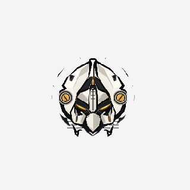
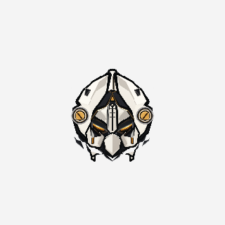

# Robot cleanliness + sharpness diagnostic checkpoint

**Status: ready for owner review — not Robot final.**

| Decision | Result |
|---|---|
| Reproducible artifact defect? | **Yes.** Caliper/pivot mask ownership and unclipped backplate hatching. Both are inherited in the golden HTML. |
| Reproducible sharpness limitation? | **Yes at DPR 2.** Fixed final game backing under-resolves the displayed Robot. Not a blanket DPR-1 defect. |
| Production changed? | **Mask coverage and backplate clipping only.** No sharpness/render-target change. |
| Robot-only 2× candidate? | **Rejected:** no meaningful normal-scale improvement through the unchanged final canvas. |

## Authority and scope

- Session branch: `arena/01a0ead6-apex-chaos`.
- Starting authority: `bdf29a75770e2013e08bd2b005b8c4eae371b229`, fetched and verified before work. The owner's exact SHA supersedes the stale SHA printed in the execution task.
- Golden HTML SHA-256, unchanged: `bd0cc64fbeea94969fbef0b4bc4de690a19e85fafe93cb4a12c9b3accf095f75`.
- Only production file changed: `public/game/hero-rework/robotPresentationRuntime.js`.
- Exact path inventory: [changed-files.txt](changed-files.txt). Machine-readable decision: [decision.json](decision.json).

The original matrix, isolation pairs, source exports and 2× test were captured **before** production edits. A harness-only mask prototype followed. The final `-FIX` images were then captured from the rebuilt, un-intercepted production runtime, restoring the exact saved spring/effect states.

## 1. Cleanliness: real defects versus contrast/effects

### Normal-scale example — A2 locked, near-white, DPR 1

| Authority-baseline production | Minimal mask correction |
|---|---|
|  |  |

The thin floating outer strips and horizontal bars are actual pixels, not an optical illusion. A light background makes them conspicuous; dark backgrounds conceal much of them. They survive the explicit particle-hidden comparison.

**Cause 1 — `MASK_CUT`:** original caliper polygons exclude part of the source's exterior black stroke/pivot rim. Those pixels remain in the stationary core when the calipers move inward. Source-cache alpha connected-component inspection finds corresponding islands in **both** implementations; see [production components](edge-crops/prod-core-islands.json), [HTML components](edge-crops/html-core-islands.json), and their exported core PNGs. This is not a production-only regression.

**Correction:** extend only the alpha-mask coverage by 12 source-head units, identically for moving-caliper inclusion and core exclusion. That is 1.6125 world pixels at the unchanged 172-unit nominal head size. The six-unit prototype left upper slivers; twelve removed them. `edge-crops/mask-test-*-pad{0,6,12}.png` records those trials. The stroke is applied to an intermediate **mask**, never to the source artwork or final canvas: no heavier artwork outlines, redrawn plates, SR increase, or contrast filter.

**Cause 2 — `MASK_CUT`:** backplate hatch lines run from x=300 to x=980 without clipping to the existing hull. Lower lines escape the hull and show through the transparent space beside/below the face. The correction clips those existing interior details to `HULL`.

### Things deliberately retained

- `AUTHORED_PARTICLE` / `WORLD_EFFECT`: impact sparks/chips, local flash/stress and legitimate mechanical world effects. No production particle suppression.
- `MASK_GAP`: intended plate separation during motion. Larger disconnected lower cheek/chin/chassis pieces are not automatically defects and were not deleted.
- `ALPHA_FRINGE`: no independent matte/premultiplied-alpha defect established. Normal antialiasing remains.
- `SUBPIXEL_SOFTNESS`: narrow diagonal details necessarily filter at this size.
- `NO_DEFECT`: authored crest channel, eye glow, socket shadows and plate geometry remain.

Every crop is indexed with its region, source rectangle, taxonomy and assessment in [edge-crops/index.json](edge-crops/index.json). There are 72 baseline and 72 corresponding corrected **4× diagnostic** crops: eight regions × three states × three backgrounds. Nearest-neighbor enlargement is used only to inspect these crops, never in production. They are not the normal-scale acceptance evidence.

## 2. Controlled impact isolation

`impact-isolation/dpr{1,2}-{black,gray,white}-A-normal.png` and `...-B-no-world-particles.png` use the **same saved real PISTOL-hit state**, two simulation frames after the controlled hit. Only `st.parts` is hidden in B; spring pose, local stress, pulses/ticks and lock/impact flash are retained. Corrected isolated images use `...-FIX-no-world-particles.png`; corrected normal images are the matrix's `...-impact-...-FIX.png`.

The disappearing moving specks are legitimate world effects. The original stationary strips persist without them, establishing a separate mask defect. Near-white also makes bright sparks less visible; that is contrast, not proof that particles were removed.

## 3. Sharpness: matched size, separate decision

Chromium `153.0.8010.0`, viewport 1440×1000, separate DPR-1 and DPR-2 pages, same state snapshots and display fit. Screenshots cover 320×320 CSS pixels, saved natively as 320×320 or 640×640 device pixels; no screenshot resizing.

| Measurement | DPR 1 | DPR 2 |
|---|---:|---:|
| APEX canvas CSS size | 953×953 | 953×953 |
| APEX canvas backing | 1000×1000 | 1000×1000 |
| Nominal Robot head box, CSS px | 163.916 | 163.916 |
| Nominal head box, physical px | 163.916 | 327.832 |
| APEX backing samples across that box | 172 | 172 |
| HTML backing samples across that box | 163.916 | 327.832 |
| HTML rig render target | 205×205 | 410×410 |
| HTML page backing | 1440×1000 | 2880×2000 |
| Source / segment-cache side, both implementations | 1280 / 820 | 1280 / 820 |
| Candidate B Robot-only RT | 640×640 over 320 world units | Same |

The nominal box is the rig's scale measure, not its tight visible-alpha bounds. Actual raster bounds, full state snapshots and exact dimensions are in [sharpness-metrics.json](sharpness-metrics.json).

- **A — current production:** direct segmented drawing into the fixed game backing.
- **B — 2× Robot-only offscreen:** same world size, 2× game-backing sampling, then composited into that same final backing. It slightly changes antialiasing but does not recover the missing final DPR-2 samples. No meaningful normal-scale gain established; rejected before pursuing temporal/performance qualification. No claim that B improves motion or frame time.
- **C — adaptive DPR capped at 2:** omitted because it offers no useful additional evidence over B at DPR 2 while the final backing remains fixed.
- DPR 1 does **not** show a consistent production sharpness deficit; the HTML's additional render-target resampling can look softer there.

Compare `sharpness-ab/dpr{1,2}-{idle,lock,impact}-{A-current,B-2x,HTML}.png`. A DPR-2 screenshot has twice as many device pixels: view at its intended 320 CSS-pixel size on a DPR-2 display for normal-scale judgment, rather than interpreting a 640-CSS-pixel enlargement as normal size.

**Important confound:** the HTML rasterizes native SVG gradients/glow; production reconstructs paths with Canvas gradients/shadows. Some material differences are not sampling differences. No attempt was made to repaint materials as a sharpness fix.

**Harness boundary:** HTML images use its unchanged `ensureRT`/`renderRig`/`blitRobot` pipeline at the matched size, with saved production spring/local-effect state. They exclude HTML stage/vignette, extra scene bloom and world effects to isolate the rig. They are labeled rig comparisons, not full untouched HTML-stage screenshots. Production normal captures retain the Robot's world particles; only the explicit isolation-B images hide them. Camera shake, AI, unrelated opponent drawing and unrelated scene VFX are excluded from the static matrix.

**Conclusion:** DPR-2 final-backing softness is genuine but remains unresolved by the tested bounded Robot-only path. No global renderer modification, arbitrary SR increase, filtering or game-scale change was made.

## 4. Movement and focused validation

[Movement stability clip](movement-stability.webm): actual production game drawing/physics, directional movement followed by A2, ROBOT versus ICE with AI disabled and camera shake zeroed. The change adds no per-frame rendering path, transform or layer-registration logic. No new temporal instability was identified in the reviewed sequence; existing small-size antialiasing remains. Owner review of the clip is still required.

[focused-validation.json](focused-validation.json) and [robot-gates-report.json](robot-gates-report.json):

| Check | Result |
|---|---|
| Fresh production build | PASS |
| Robot R1–R9 | **9/9 PASS** |
| Fixed-world-facing body | Identical raster hashes at four movement headings |
| A1 fresh trail / trail off after completion | PASS |
| Real PISTOL pickup and jaw/grip attachment | PASS; actual draw anchors match socket at four aim angles |
| A2 actual incoming fire from left/right | PASS; opposite source vectors, real damage and local stress |
| Robot blood suppressed / non-Robot blood preserved | PASS; real projectile damage |
| AudioContext count | **1** |
| Browser exit/navigation cleanup | PASS; captured runtime error list empty |

No choreography, gameplay, socket/recoil, blood logic, sound mappings, other-hero code or global renderer was edited. All eight approved SFX mappings remain unchanged by source diff; this is not a new audio-quality approval pass. PAINTER behavior is untouched.

Bounded timing: 150 draws after 30 warmup, including clear/draw/readback flush in software headless Chromium. Baseline mean **18.834 ms**, corrected **19.361 ms** (+2.8%); p95 **24.7 / 25.9 ms**. This single sequential microbenchmark is not a statistically conclusive regression or a player-FPS guarantee. The extra mask work is cache construction only, not per-frame. No broad performance or repository regression marathon was run.

## 5. Evidence and reproduction

- `background-matrix/`: 36 baseline production/HTML frames plus 18 corrected frames, both DPRs, all states/backgrounds. `-HTML` means reference rig; `-FIX` means rebuilt production; no suffix means authority baseline.
- `edge-crops/`: labeled baseline/corrected 4× regions, original source/segment exports, alpha-component reports and mask prototype trials.
- `impact-isolation/`: exact-state normal/hidden-world-particle pairs and corrected isolated frames.
- `sharpness-ab/`: A/B/HTML, three states at both DPRs on gray.
- `sharpness-metrics.json`, `decision.json`, focused reports and movement clip.

Harness scripts are diagnostic-only and are not shipped game code. `run-diagnostic.mjs` and `mask-ab.mjs` deliberately read the runtime from the exact starting authority via `git show`, so rerunning after the fix does not relabel fixed production as the baseline. `final-check.mjs` uses the current fresh production build without runtime interception for final evidence.

With dependencies available (`puppeteer-core`, `@sparticuz/chromium`, `@napi-rs/canvas`, plus repository dependencies), build and serve the production preview on port 4173, then run from repository root:

```sh
node docs/hero-rework/robot-visual-cleanup-diagnostic/run-diagnostic.mjs
node docs/hero-rework/robot-visual-cleanup-diagnostic/mask-ab.mjs
mkdir -p /home/user/robot-diagnostic-gates
AQ_EVIDENCE_DIR=/home/user/robot-diagnostic-gates node tools/testHeroReworkRobotGates.mjs
node docs/hero-rework/robot-visual-cleanup-diagnostic/final-check.mjs
node docs/hero-rework/robot-visual-cleanup-diagnostic/inspect-crops.mjs
```

These regenerate raw measurements/captures; the taxonomy and decision annotations are reviewed analysis, not an automated sharpness score. Build-generated manifest timestamp churn was discarded; no dependency manifests changed. Golden checksum and `git diff --check` were revalidated before the checkpoint.

**Stop here for owner review. No further polishing or Robot-final claim.**
